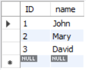
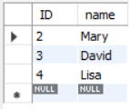
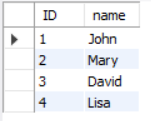
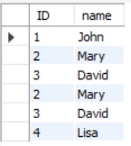
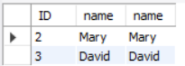

## Ex-06 SET OPERATIONS
## AIM:-
To write a sql query to perform set operations on two tables.

## PROCEDURE:-
### STEP 1:
create database SET_OPERATION.

### STEP 2:
create table A,B.

### STEP 3:
Insert Value to the tables.

### STEP 4:
Perform Set operations like Union,Union all,Intersect,Except.

### PROGRAM:-
#### Developed By : Sarankumar J
#### Register Number : 212221230087
```sql
CREATE DATABASE SET_OPERATION;
SHOW DATABASES;
USE SET_OPERATION;
CREATE TABLE A (
  ID INT PRIMARY KEY,
  name VARCHAR(50)
);
CREATE TABLE B (
  ID INT PRIMARY KEY,
  name VARCHAR(50)
);
INSERT INTO A (ID, name) VALUES (1, 'John');
INSERT INTO A (ID, name) VALUES (2, 'Mary');
INSERT INTO A (ID, name) VALUES (3, 'David');
INSERT INTO B (ID, name) VALUES (2, 'Mary');
INSERT INTO B (ID, name) VALUES (3, 'David');
INSERT INTO B (ID, name) VALUES (4, 'Lisa');
SELECT * FROM A;

SELECT * FROM B;

SELECT * FROM A
UNION
SELECT * FROM B;

SELECT * FROM A
UNION ALL
SELECT * FROM B;

SELECT * FROM A
INTERSECT
SELECT * FROM B;

SELECT * FROM A
EXCEPT
SELECT * FROM B;
```
## OUTPUT:-

<br>
<br>
<br>
<br>
<br>

## RESULT:-
A sql query to perform set operations on two tables has been executed.
